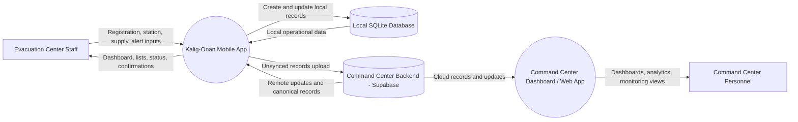
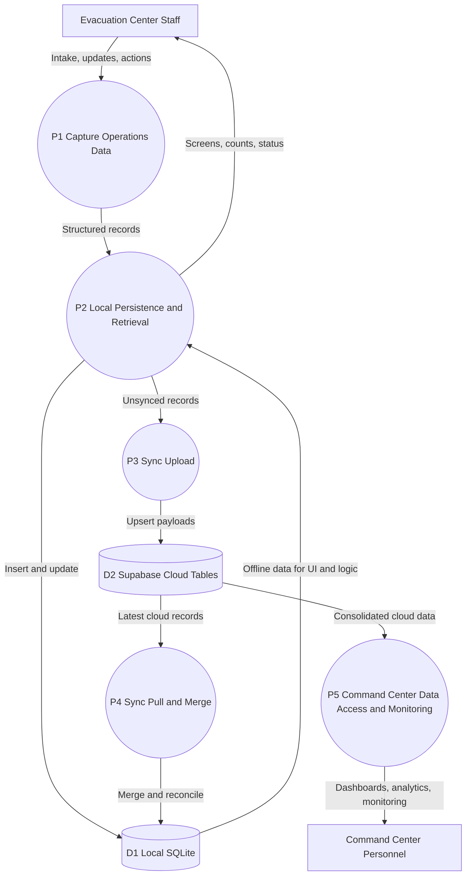

# Kalig-Onan Evacuation Center System

A mobile, offline-first disaster management system that helps evacuation centers track capacity, manage evacuees, monitor medical supplies, and coordinate with responders, while syncing data to authorities once connectivity is restored.

==============================================================================================

## Developer Roles:
### Logicale-Plague (Ramos)
- Improve app functionality and runtime, app testing
### Maruuu (Rosialda)
- Integration of offline maps, locators, AI
### way2donatt / Ozanii (Superficial / Cari)
- Frontend / improve UI UX for priority 1
### banm1do (Babac)
- Pitch

==============================================================================================

## Development Priority Order:

### Priority 1
- Locator (offline preloaded maps, GPS-based positioning)
- Capacity Tracking (total capacity, current number of evacuees, status)
- Registration (name (optional), age group, medical flag (yes/no))
- Offline storage
- Synchronization when online (with resolving conflicts)
- Smart predictions
- Visual analytics
- Minimal UI

### Priority 2
- Local sharing
- Alerts
- User viewing (non-personnel)

### Priority 3
- Medical supply system

### Priority 4
- Mesh networking

==============================================================================================

## Development Methodology:
### Risk-Based Incremental Delivery with Stage-Gate Verification
- A development methodology where features are implemented by priority, validated through continuous feature-level testing, and advanced only after successful integration and system testing at each priority gate.

==============================================================================================

## Users:

### Evacuation Center Personnel --------------------- (Priority 1)
- Manage evacuees
- Track capacity
- Monitor supplies

### Command Center ---------------------------------- (Priority 1)
- Receive synced 

### Evacuees / Public users ------------------------- (Priority 2)
- Find evacuation centers (offline maps)
- Check availability 

### Medical Suppliers / Responders ------------------ (Priority 3)
- View requests
- Deliver supplies

==============================================================================================

## Core Features:

### Offline Evacuation Center Locator
- Uses GPS + offline maps						(1)
- Shows capacity status							(1)
- Share information (from another center)		(1)

### Smart Capacity Tracking
- Auto-calculate occupancy						(1)
- Overcrowding risk prediction					(1)

### Offline registration system
- Assigns each evacuee:							(1)
	- name (optional)
	- ID
	- age group
	- medical condition

### Offline Alert System
- Alerts nearby users							(2)

### Offline Data + Sync
- Stores data locally							(1)
- Auto-sync when connection returns				(1)
- Conflict resolution							(1)

### Medical Supply Tracking
- Tracks stock levels, usage rate				(3)
- Estimates days remaining						(1)

### Supply Prediction System
- Predict needs using:							(1)
	- number of evacuees
	- age groups
	- common post-disaster diseases

### Supplier request system
- Priority levels (urgent/moderate)				(3)
- Sends when connection returns					(3)

==============================================================================================

## Formal Data Flow Diagram (DFD)

### DFD Level 0: Context Diagram
              
System boundaries:
- Kalig-Onan Evacuation Center Mobile App
- Command Center Dashboard / Web App

External entities:
- Evacuation Center Staff
- Command Center Personnel

Shared cloud platform:
- Command Center Backend (Supabase)

Primary data store:
- Local SQLite Database

Main flows:
- Staff submits registration, station, supply, and alert updates to the mobile app.
- Mobile app stores and reads operational data from Local SQLite.
- Mobile app uploads unsynced records to Command Center Backend when online.
- Mobile app pulls updates from Command Center Backend and merges to Local SQLite.
- Command Center Dashboard / Web App reads consolidated cloud data from Command Center Backend.
- Command Center Personnel views dashboards, analytics, and monitoring data through the Command Center Dashboard / Web App.
- Mobile app presents dashboards, lists, and sync status back to staff.

### DFD Level 1: Process Decomposition

Processes:
- P1: Capture Operations Data (registration, stations, supplies, alerts)
- P2: Local Persistence and Retrieval
- P3: Sync Upload (local unsynced to Supabase)
- P4: Sync Pull and Merge (Supabase to local)
- P5: Command Center Data Access and Monitoring

Data stores:
- D1: Local SQLite (evacuation_centers, stations, evacuees, supplies, alerts)
- D2: Supabase Cloud Tables

Detailed flows:
- E1 -> P1: Staff inputs and operational actions
- P1 -> P2: Validated domain records with sync flags
- P2 <-> D1: Offline-first writes and reads
- P2 -> P3: Unsynced records by entity type
- P3 -> D2: Upsert payloads to cloud
- D2 -> P4: Cloud records and updates
- P4 -> D1: Merged local records and sync state updates
- D1 -> P2 -> E1: Updated dashboards, counts, and lists
- D2 -> P5: Cloud records for centers, evacuees, supplies, and alerts
- P5 -> E2: Command center dashboards, analytics, and monitoring reports

==============================================================================================

## What the users should see

### Evacuation Center Staff (Priority 1)
- Dashboard Screen
	- Total Capacity (calculated from all rooms/stations)
	- Current Occupancy (calculated from all rooms/stations)
	- Status
	- Quick buttons (add, remove, check supplies)
- Registration Screen
	- ID
	- Age group (child, adult, elderly)
	- Medical condition (none, minor, serious)
	- Upon evacuees' arrival, assigns them room first (adds as unnamed)
	- Save (offline)
- Supplies Screen
	- View available medical supplies
	- If online, can use smart predictions
- Stations Screen
	- List of stations under the evacuation center
	- Click a station to reveal more information
	- Evacuees can set their names 
- Evacuees List Screen
	- List of all evacuees and their details
	- If unnamed, shows up as ID
- Sync Screen
	- Status (offline / synced)
	- Button (upload to command center)

### Command Center (Priority 1)
- Overview Dashboard
	- Total evacuation centers
	- Overcrowded centers
	- Supply shortages (possibly with smart predictions)
- Visual Analytics
	- Only functions when online
	- Shows visual data (with the aid of AI)
- Resource Monitoring
	- Monitors centers' medicine supplies and capacity

### Evacuee / Public User (Priority 2)
- Home Screen
	- "Find nearest evacuation center"
	- Offline map
	- Status (available, near full, full)
- Map Screen
	- User location (blue dot)
	- Evacuation centers (color-coded by capacity, only updates when nearby if offline)
	- Tap a center (shows name, most recent capacity status)
- Center Details Screen
	- Shows when the data was last updated
	- Capacity, estimated space left, basic facilities (medical available y/n)
	- Button (navigation)
- Design Rule: BIG Buttons, MINIMAL Text, Works offline

### Medical Supplier / Responder (Priority 3)
- Requests Screen
	- List of evacuation centers (name, urgency)
	- Tap -> details
- Request Details Screen
	- Needed supplies
	- Location
	- Button (accept/deny)
- Navigation Screen
	- Map with route to center

