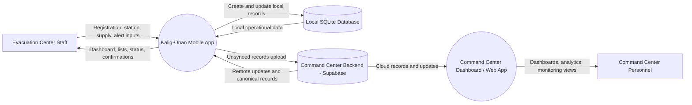
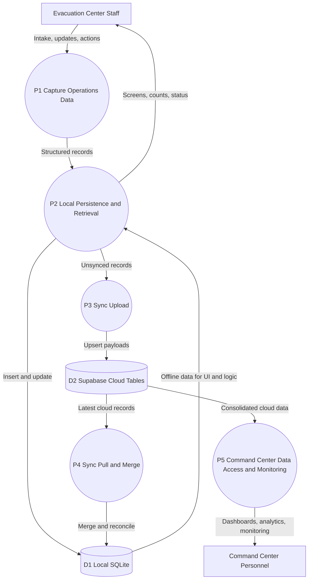

# Kalig-Onan Evacuation Center System

A mobile, offline-first disaster management system that helps evacuation centers track capacity, manage evacuees, monitor medical supplies, and coordinate with responders, while syncing data to authorities once connectivity is restored.

===

## Developer Roles:
### Logicale-Plague (Ramos)
- Improve app functionality and runtime, app testing
### Maruuu (Rosialda)
- Integration of offline maps, locators, AI
### way2donatt / Ozanii (Superficial / Cari)
- Frontend / improve UI UX for priority 1
### banm1do (Babac)
- Pitch

===

## Development Priority Order:

### Priority 1
- Locator (offline preloaded maps, GPS-based positioning)
- Capacity Tracking (total capacity, current number of evacuees, status)
- Registration (name (optional), age group, medical flag (yes/no))
- Offline storage
- Synchronization when online (with resolving conflicts)
- Smart predictions
- Visual analytics
- Minimal UI

### Priority 2
- Local sharing
- Alerts
- User viewing (non-personnel)

### Priority 3
- Medical supply system

### Priority 4
- Mesh networking

===

## Development Methodology:
### Risk-Based Incremental Delivery with Stage-Gate Verification
- A development methodology where features are implemented by priority, validated through continuous feature-level testing, and advanced only after successful integration and system testing at each priority gate.

===

## Users:

### Evacuation Center Personnel --------------------- (Priority 1)
- Manage evacuees
- Track capacity
- Monitor supplies

### Command Center ---------------------------------- (Priority 1)
- Receive synced 

### Evacuees / Public users ------------------------- (Priority 2)
- Find evacuation centers (offline maps)
- Check availability 

### Medical Suppliers / Responders ------------------ (Priority 3)
- View requests
- Deliver supplies

===

## Core Features:

### Offline Evacuation Center Locator
- Uses GPS + offline maps						(1)
- Shows capacity status							(1)
- Share information (from another center)		(1)

### Smart Capacity Tracking
- Auto-calculate occupancy						(1)
- Overcrowding risk prediction					(1)

### Offline registration system
- Assigns each evacuee:							(1)
	- name (optional)
	- ID
	- age group
	- medical condition

### Offline Alert System
- Alerts nearby users							(4)

### Offline Data + Sync
- Stores data locally							(1)
- Auto-sync when connection returns				(1)
- Conflict resolution							(1)

### Medical Supply Tracking
- Tracks stock levels, usage rate				(3)
- Estimates days remaining						(1)

### Supply Prediction System
- Predict needs using:							(1)
	- number of evacuees
	- age groups
	- common post-disaster diseases

### Supplier request system
- Priority levels (urgent/moderate)				(3)
- Sends when connection returns					(3)

===

## Formal Data Flow Diagram (DFD)

### DFD Level 0: Context Diagram
              
System boundaries:
- Kalig-Onan Evacuation Center Mobile App
- Command Center Dashboard / Web App

External entities:
- Evacuation Center Staff
- Command Center Personnel

Shared cloud platform:
- Command Center Backend (Supabase)

Primary data store:
- Local SQLite Database

Main flows:
- Staff submits registration, station, supply, and alert updates to the mobile app.
- Mobile app stores and reads operational data from Local SQLite.
- Mobile app uploads unsynced records to Command Center Backend when online.
- Mobile app pulls updates from Command Center Backend and merges to Local SQLite.
- Command Center Dashboard / Web App reads consolidated cloud data from Command Center Backend.
- Command Center Personnel views dashboards, analytics, and monitoring data through the Command Center Dashboard / Web App.
- Mobile app presents dashboards, lists, and sync status back to staff.

### DFD Level 1: Process Decomposition

Processes:
- P1: Capture Operations Data (registration, stations, supplies, alerts)
- P2: Local Persistence and Retrieval
- P3: Sync Upload (local unsynced to Supabase)
- P4: Sync Pull and Merge (Supabase to local)
- P5: Command Center Data Access and Monitoring

Data stores:
- D1: Local SQLite (evacuation_centers, stations, evacuees, supplies, alerts)
- D2: Supabase Cloud Tables

Detailed flows:
- E1 -> P1: Staff inputs and operational actions
- P1 -> P2: Validated domain records with sync flags
- P2 <-> D1: Offline-first writes and reads
- P2 -> P3: Unsynced records by entity type
- P3 -> D2: Upsert payloads to cloud
- D2 -> P4: Cloud records and updates
- P4 -> D1: Merged local records and sync state updates
- D1 -> P2 -> E1: Updated dashboards, counts, and lists
- D2 -> P5: Cloud records for centers, evacuees, supplies, and alerts
- P5 -> E2: Command center dashboards, analytics, and monitoring reports

===

## What the users should see

### Evacuation Center Staff (Priority 1)
- Dashboard Screen
	- Total Capacity (calculated from all rooms/stations)
	- Current Occupancy (calculated from all rooms/stations)
	- Status
	- Quick buttons (add, remove, check supplies)
- Registration Screen
	- ID
	- Age group (child, adult, elderly)
	- Medical condition (none, minor, serious)
	- Upon evacuees' arrival, assigns them room first (adds as unnamed)
	- Save (offline)
- Supplies Screen
	- View available medical supplies
	- If online, can use smart predictions
- Stations Screen
	- List of stations under the evacuation center
	- Click a station to reveal more information
	- Evacuees can set their names 
- Evacuees List Screen
	- List of all evacuees and their details
	- If unnamed, shows up as ID
- Sync Screen
	- Status (offline / synced)
	- Button (upload to command center)

### Command Center (Priority 1)
- Overview Dashboard
	- Total evacuation centers
	- Overcrowded centers
	- Supply shortages (possibly with smart predictions)
- Visual Analytics
	- Only functions when online
	- Shows visual data (with the aid of AI)
- Resource Monitoring
	- Monitors centers' medicine supplies and capacity

### Evacuee / Public User (Priority 2)
- Home Screen
	- "Find nearest evacuation center"
	- Offline map
	- Status (available, near full, full)
- Map Screen
	- User location (blue dot)
	- Evacuation centers (color-coded by capacity, only updates when nearby if offline)
	- Tap a center (shows name, most recent capacity status)
- Center Details Screen
	- Shows when the data was last updated
	- Capacity, estimated space left, basic facilities (medical available y/n)
	- Button (navigation)
- Design Rule: BIG Buttons, MINIMAL Text, Works offline

### Medical Supplier / Responder (Priority 3)
- Requests Screen
	- List of evacuation centers (name, urgency)
	- Tap -> details
- Request Details Screen
	- Needed supplies
	- Location
	- Button (accept/deny)
- Navigation Screen
	- Map with route to center

===

## Future Improvements:
- Public Users can also download the app
- Prior to the disaster, the app should notify the following to the user:
	- Details about the incoming disaster
	- Optimized list of evacuation center options (with the use of AI)
- The app with added features should also cater to other disasters like earthquakes or fires

===

## Use Cases:
### Evacuation Center
- Register Center (online)
- Update Center (offline + sync)
### Evacuee
- Log Arrival (offline + sync)
- Update Evacuee (offline + sync)
### Maps
- Locate Center (offline)
### Station 
- Register Station (online)
- Update Station (offline + sync)
- Delete Station (soft delete, offline, requires assigning evacuees elsewhere)
### Supply
- Insert Supply (offline + sync)
- Update Supply (offline + sync)
### Sync
- Conflict Resolve (sync when online)
### User
- Create Account (online)

---

# Project Documentation

## Project Description

**Kalig-Onan Evacuation Center System** is a mobile-first, offline-capable disaster management application designed to support evacuation center staff in managing evacuees, tracking facility capacity, monitoring medical supplies, and coordinating information with command centers. The system operates independently of internet connectivity while maintaining a synchronization mechanism to share data with authorities once a connection is restored.

The app is built with a disaster-response focus, prioritizing speed and simplicity over feature complexity. It enables rapid evacuee registration, real-time capacity monitoring, and critical supply tracking, which are all essential functions during emergencies when communication infrastructure may be compromised.

---

## Technology Stack

	
	
	
	
	

### Frontend & Framework
- **Flutter 3.x** — Cross-platform mobile development framework
- **Dart** — Primary programming language

### Offline-First & Local Storage
- **SQLite (sqflite v2.3.0)** — Local relational database for offline data persistence
- **Flutter Secure Storage (v9.2.4)** — Encrypted storage for sensitive credentials

### Backend & Cloud Services
- **Supabase (v2.12.0)** — Backend-as-a-service for authentication, APIs, and cloud data storage
- **PostgreSQL** — Cloud database (via Supabase)

### Mapping & Location Services
- **Mapbox Maps Flutter (v2.20.0)** — Offline-capable maps and geospatial rendering
- **Geolocator (v14.0.2)** — GPS position and location accuracy
- **Location (v8.0.1)** — Location permission and background updates

---

## Implemented Features

### Authentication & User Management
- User account creation with email/password
- Secure credential storage using encrypted local storage
- Supabase authentication integration
- Role-based access control (Staff, Admin, Public)
- Session persistence across app restarts

### Evacuation Center Management (Admin)
- **Dashboard Screen** — View overall statistics, including supply shortages and overcrowded centers
- **Center Registration** — Create and configure evacuation centers from map (online only, initial setup)
- **Center Tracking** — Real-time tracking of center status (Operational, Near Capacity, At Capacity)

### Evacuee Management (Staff)
- **Two-Step Registration System** — Register evacuees with age group (Child/Adult/Elderly), and medical condition (None/Minor/Serious). Evacuee details such as name can be edited later
- **Evacuee List View** — Display all registered evacuees with details and search capability
- **Offline Registration** — Complete registration workflow without internet connectivity

### Station Management (Staff)
- **Station Creation** — Register stations/rooms within an evacuation center
- **Station Updates** — Modify station details and capacity
- **Multi-Station Support** — Manage multiple stations/rooms with individual capacity tracking
- **Offline-Capable** — Full station management works offline

### Medical Supply Management (Staff)
- **Supply Tracking** — Monitor medical supply inventory with name, current stock, and daily usage rate
- **Stock Status Indicators** — Color-coded status (Critical/Red, Low/Orange, Adequate/Green)
- **Days Remaining Calculation** — Automatic calculation based on current stock and usage rate
- **Stock Updates** — Modify stock quantities as supplies are used or restocked

### Data Synchronization
- **Offline-First Architecture** — Staff operations work without internet
- **Automatic Sync Detection** — System detects when connectivity is restored
- **Data Upload** — Automatic upload of unsynced records to Supabase
- **Data Download** — Receive updates from command center
- **Conflict Resolution** — Automatic handling of conflicting updates
- **Sync Status Screen** — View sync history, pending updates, and last sync timestamp
- **Manual Sync Trigger** — Staff can manually initiate data synchronization

### Offline Maps (Public User - Limited)
- ✅ **Mapbox Integration** — Offline map rendering
- ✅ **GPS Location Tracking** — Display user's current location
- ✅ **Map Display** — Show evacuation center locations on map

### User Interface
- ✅ **Material 3 Design** — Modern, accessibility-focused UI
- ✅ **Responsive Layout** — Adapts to various screen sizes
- ✅ **Large Touch Targets** — Buttons optimized for quick interaction during emergencies
- ✅ **Dark Mode Support** — System theme preference support
- ✅ **Color-Coded Status Indicators** — Visual identification of critical information

### Platform Support
- ✅ **Android** — Full support with native Android 

---

## Tutorial: Testing the App (For Judges & Evaluators)

### Test Account Credentials

To evaluate different roles and features of the application, use the following test accounts. All passwords are: **`test123`**

| Role | Email | Password | Purpose |
|------|-------|----------|---------|
| Admin | `admintest@gmail.com` | `test123` | Administrative panel and system oversight |
| Staff | `stafftest@gmail.com` | `test123` | Evacuation center operations and evacuee management |
| User (Public) | `usertest@gmail.com` | `test123` | Public evacuee view and map features |

### Getting Started

1. Install the app on your test device (Android or iOS)
2. Check your connection. The first login should be online
3. Launch the app and tap **Login** (or **Create Account** if you need to add a test account)
4. Enter the appropriate test email and password from the table above
5. Once logged in, the app will initialize and display the role-specific interface

---

### Testing Admin Panel

**Login with:** `admintest@gmail.com` / `test123`

The admin account provides system-wide oversight and monitoring capabilities.

### Dashboard Screen
1. After login, you'll see the **Overview Page**. For now, it is a placeholder for future developments
2. At the bottom screen are the buttons **Overview**, **Command Centers**, and **Profile**
3. In the **Command Centers Page**, you'll see a list of command centers
4. Tap on a command center. You will be redirected to the dashboard of that command center
5. View and test:
	- **Overview Statistics** — Total evacuation centers, overcrowded centers, supply shortages
	- **Supply Shortage Details** — List of evacuation centers with supply shortages
	- **Overcrowded Centers** — List of evacuation centers with at least 80% occupancy

#### Testing Evacuation Center Registration
1. Upon entering a command center, tap **Map** at the bottom of the screen
2. Zoom in the map
3. Test adding an evacuation center:
	- Long-press on a location
	- Enter a name for the evacuation center
 	- Check the evacuation centers list and the map. It should appear in both

#### Expected Behavior
- Admin dashboard should display aggregated data from all evacuation centers
- Charts and analytics should update when new data syncs from staff centers
- System should show overall resource allocation across the facility network

---

### Testing Evacuation Center Staff Interface

**Login with:** `stafftest@gmail.com` / `test123`

The staff account simulates real-world evacuation center operations. This is the primary interface tested during deployment.

#### Dashboard Screen
1. After login, you'll see the **Main Dashboard**
2. View and test:
   - **Total Capacity** — Maximum evacuees the center can accommodate
   - **Current Occupancy** — Number of registered evacuees
   - **Occupancy Rate** — Percentage of capacity used
   - **Status Badge** — Shows center status (Operational, Near Capacity, At Capacity)
   - **Quick Action Buttons** — For adding evacuees, managing supplies, etc.

#### Testing Evacuee Registration (Offline Capability)
1. Tap **Add Evacuee** button
2. Fill in the registration form:
   - **Age Group** — Select Child, Adult, or Elderly
   - **Medical Condition** — Select None, Minor, or Serious
   - Register the name of the evacuee later in the **View Evacuees**
3. Tap **Save** — Evacuee is registered immediately offline
4. Return to dashboard and verify occupancy increased
5. Repeat multiple times to test capacity tracking

#### Testing Evacuee Management
1. Tap **View Evacuees** button
2. Verify all registered evacuees are listed with:
   - Unique ID (auto-generated UUID)
   - Name (if provided) or just ID (if unnamed)
   - Age group and medical condition
   - Registration timestamp
3. You can choose to edit an evacuee
   - Tap on the edit button at the right
   - Try changing the details, especially the age group and medical condition
   - Doing so should change what the station assignment shows

#### Testing Station/Room Management
1. Tap **Stations** button
2. Test adding a new station:
   - Tap **Add Station**
   - Enter station name (e.g., "Main Hall", "Gymnasium", "Cafeteria")
   - Enter station capacity
   - Tap **Save**
3. Test viewing station details:
   - Tap on any station
   - View current occupancy and capacity
   - See list of evacuees assigned to that station
4. Repeat to create multiple stations and distribute evacuees

#### Testing Medical Supply Tracking
1. Tap **View Supplies** button
2. Examine the **Supplies Screen**:
   - **Supply Name** — Type of medical supply
   - **Current Stock** — Quantity available
   - **Daily Usage Rate** — How much is consumed per day
   - **Days Remaining** — Automatically calculated (stock ÷ daily usage)
   - **Status Indicator** — Color-coded (Red = Critical, Orange = Low, Green = Adequate)
3. Test adding supplies:
   - Tap **Add Supply**
   - Enter: Supply name, initial stock, daily usage rate
   - Tap **Save**
4. Test updating supplies:
   - Tap on a supply entry
   - Modify stock quantity (simulate usage)
   - Update usage rate if needed
   - Tap **Update**
5. Observe status colors changing as stock decreases

#### Testing Data Synchronization (Offline-First)
1. Tap **Sync** or **View Sync Status** button
2. Examine the **Sync Screen**:
   - **Connection Status** — Shows "Online" or "Offline"
   - **Pending Updates** — Number of unsynced local records
   - **Last Sync Time** — Timestamp of most recent sync
3. **To Test Offline Registration** (Primary Feature):
   - Turn off device WiFi and mobile data
   - Add 5-10 evacuees using the registration screen
   - Add or update 2-3 supplies
   - Verify data is saved locally (check dashboard occupancy)
   - Connection status should show "Offline"
4. **To Test Sync When Online**:
   - Turn WiFi or mobile data back on
   - Return to Sync Screen
   - Tap **Upload to Command Center** (manual sync)
   - Observe pending updates count decrease
   - Last sync time should update
   - All records should be marked as synced once complete
5. **Verify Offline-First Behavior**:
   - All operations should work smoothly whether online or offline
   - Data entry should never be blocked by connectivity
   - Sync should occur automatically in background when online

#### Testing Evacuation Scenario (Complete Workflow)
1. Start with staff account logged in
2. Simulate an evacuation:
   - Add 20-30 evacuees with varied age groups and medical conditions
   - Create 3-4 stations/rooms
   - Distribute evacuees across stations
   - Set up medical supplies (first aid kits, medications, bandages)
   - Reduce supply quantities to trigger critical/low status

3. Test offline operations:
   - Disable connectivity
   - Register additional evacuees
   - Update supply usage
   - Note that all changes happen instantly and locally

4. Test sync:
   - Enable connectivity
   - Trigger sync to send all changes to command center
   - Verify sync completes successfully
   - All records should show as synced

---

### Testing Public User Interface

**Login with:** `usertest@gmail.com` / `test123`

The public user account simulates evacuees or citizens seeking shelter information.

#### Public User Features to Test
1. **Evacuation Center Locator**
   - View list of nearby evacuation centers
   - See center names, locations, and current capacity status
   - View color-coded availability (Green = Available, Orange = Near Full, Red = Full)

2. **Map Interface**
   - **Location Display** — Blue dot shows user's current position
   - **Center Markers** — Color-coded by capacity status
   - **Tap Center** — View center name and most recent capacity status

3. **Center Details**
   - Tap a center to see full information:
     - Center name and location
     - Current capacity status
     - Last data update timestamp
     - Available facilities (medical services indicator)
   - Tap **Navigate** to open directions to the center

4. **Offline Map Usage**
   - Disable connectivity
   - Verify map still displays (uses offline tiles)
   - Verify center locations still show
   - Tap centers to see cached capacity information
   - Re-enable connectivity to fetch latest updates

---

## Contributors

	

---
